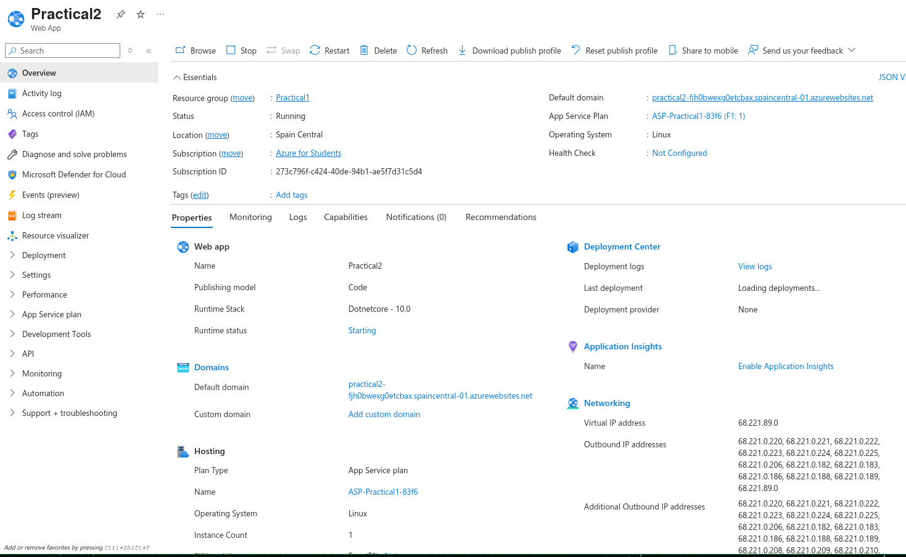
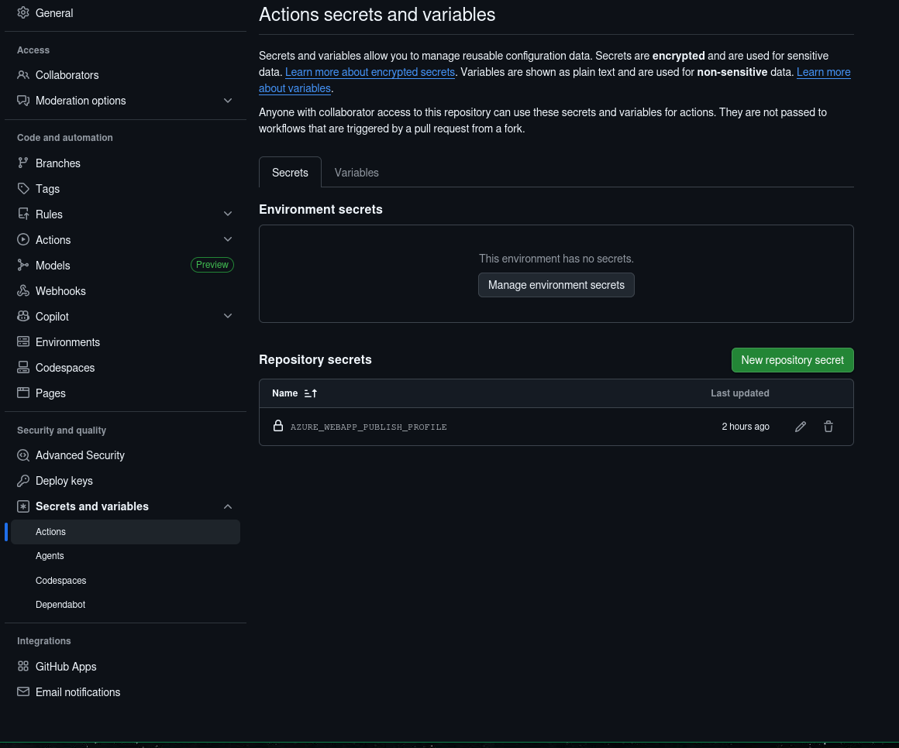
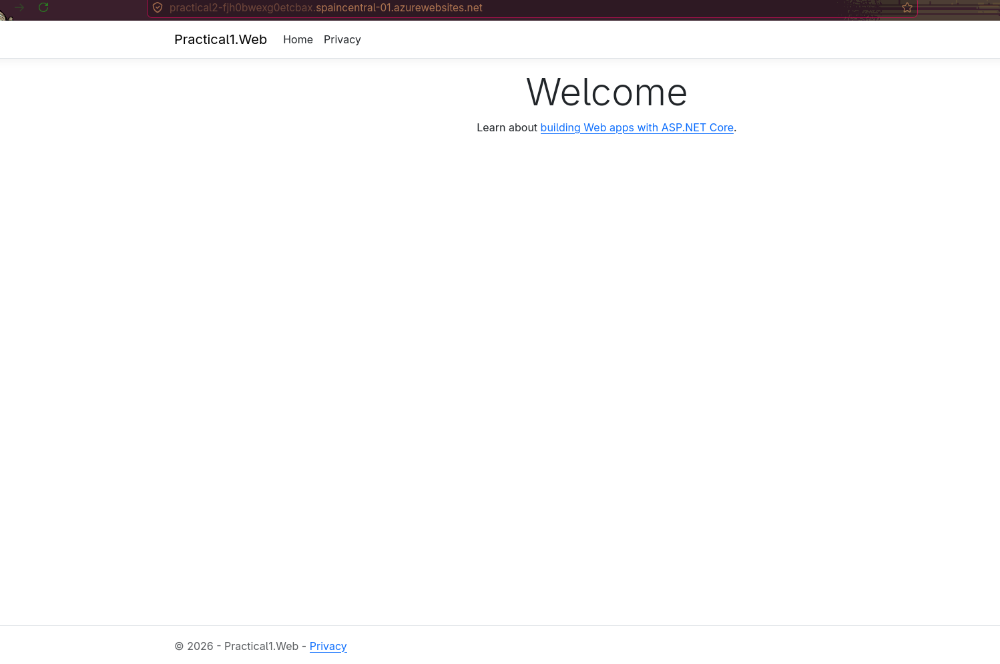

# Practical---P1-Set-up-a-basic-CI-CD-pipeline
Build a simple pipeline (e.g. GitHub Actions) that automatically runs tests and deploys a sample app on every push. Document the pipeline stages, tools chosen, and lessons learned

---
## 0. Materials and tools used
The tools used in this project are GitHub, as you can see, with the help of the actions tab, C# for the the default web app that is going to pass through the pipeline and Azure with the subscription for students, so I can deploy the app.


## 1. Creating the default app
First is creating the default app, I used the one that our Lab1 provided so I could start working with it. I used the following commands:

```C#
dotnet new sln --name Practical1
dotnet new webapp --name Practical1.Web --output src/Practical.Web
dotnet new xunit --name Practical1.Tests --output tests/Practical1.Tests

//To add then to the slnx of the beggining.
dotnet sln add src/CCITDevOps.Web/CCITDevOps.Web.csproj
dotnet sln add tests/CCITDevOps.Tests/CCITDevOps.Tests.csproj
```
Then I wrote two basic unit test for the default app and then I started doing the pipeline.

## 2. Azure
In this step I needed to create a web app on Azure so I could deploy the app. This was the hardest step for me, not because it is, but due to having a problem with my Azure subscription. After I resolved it, I just had to make sure that I had enabled the Basic Authentication on the web app and this is the result:



## 3. The pipeline.
I used the default pipeline that GitHub actions gives us for deploying a web app in Azure, ***Deploy a .NET Core app to an Azure Web App***. I just followed the steps that are written in the YAML file and committed the file, but before that we need to create a secret that is *AZURE_WEBAPP_PACKAGE_PATH* that gives access to GitHub actions to deploy to Azure without any problem and it can also be done in different ways.


After all, now every commit will be performed the CI/CD pipeline and it can be visible when the web app is up in Azure: 


## 4. Conclusion
Finally, after creating the simple pipeline was fun but in some parts where hard like I said with the Azure subscription. Now I don't know if this is what you wanted me to perform, because I didn't know if I should have added a docker container to it or not. But overall, it was a good experience.
